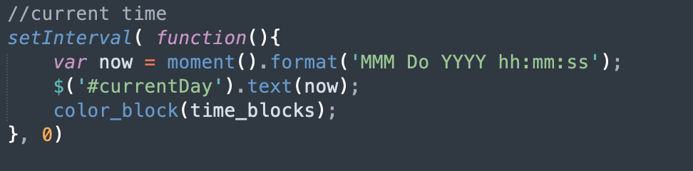
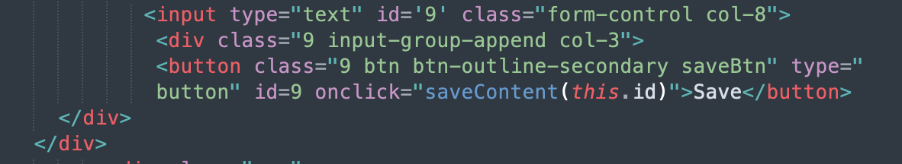

# WorkDay Schedule
I was tasked to improve and complete a schedule web application. 

## Pre Steps
For this project, I was given a starter code that I pulled from git lab onto my local machine. Following, I added the code to my local repo and pushed up the starting files to my git hub. 

## Coding Process
I first looked at the code, and assessed the appropriate steps in completeing the web application. I first began with the date functionality. Using setInterval and the moment function I was able to retrieve the current date but continually have it update After wards using bootstrap I was able to create a form that accepted inputs. By stick to the 12 rule, I designed the schedule to have text, input box, and save button aligned on the same row for each hour. Afterwards, I worked on the functionality of the save button. When the buttons were clicked I wanted to track which button was pressed in order to store the correct value. I did so by essentially giving the button id values that correlated with the id values of the input box.  This help me connect the button to the input box. When the button is pressed then the value within the input box would be saved to local storage. Afterwards, I worked on the implementation of loading saved values onto the textbox when the page loads. I retrieved the data from the local storage and checked the key value becuase the key value would correlate with the time on the schedule. Using the key value, I would locate the input box and append whatever data was associated with the key value. Finally, I improved on some of the styling through media queries and bootstrap grids. 

## Technologies Used 
CSS
CSS Bootstrap
Javascript
JQuery
HTML

## Resources 
[MDN](https://developer.mozilla.org/en-US/docs/Web/API/Request/cache)
[GetBootStrap](https://getbootstrap.com/)
[W3 Schools](https://www.w3schools.com/)
[Moment.js](https://momentjs.com/)

## Deployable Link
https://danielvo1.github.io/workday_schedule/

## Author 
Daniel Vo 